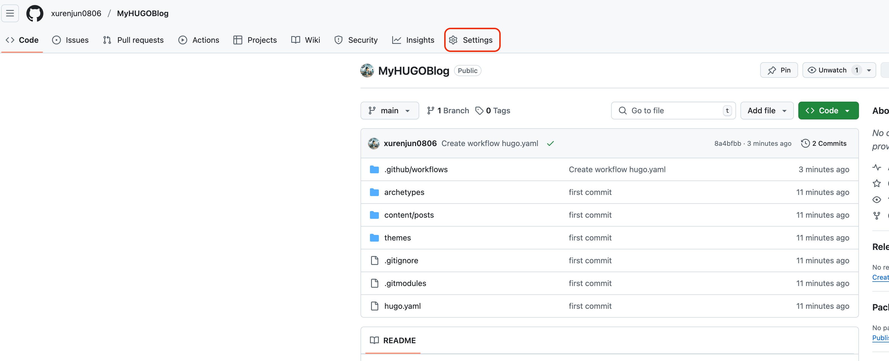
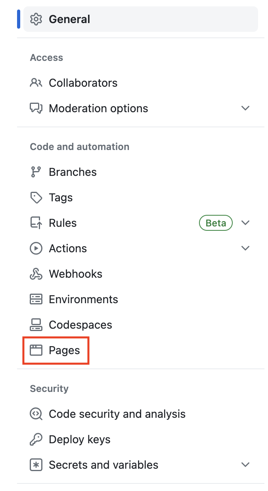
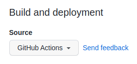
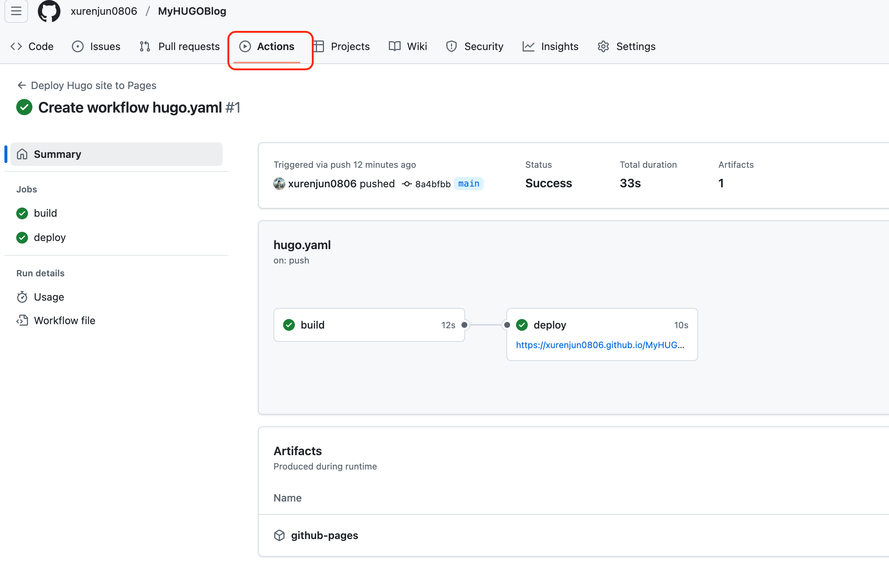

# はじめに
お久しぶりです。
1年ぐらい記事の投稿を行わなかった！キョです！
実は僕の2024年は色々ありまして、
これについては、個人ブログに投稿する予定です！

そしたら、本題に入りましょう！
今回は個人ブログを作って見ましたので、
記録として、記事で残したいと思います。
同じく個人ブログを作りたい方も参考できたら幸いです！

# 実現したいこと
今回ブログを作る上に、以下のことを実現したいです。
1. 記事ファイルは単独で管理したい
	1. 理由は以下
		1. ブログサイトを作るために利用する技術構成を変更したい時、記事ファイルを気にしなくていい
		2. 可能なら、記事ファイルを複数サイトに連携できるようにしたい（今回は個人ブログとZenn）
2. ブログのデプロイはできるだけ簡単に！！！
3. できるだけコストを抑えたい

# 利用する技術についての調査
## 最初に考えた案
僕の場合、普段Notionといつツールを愛用していますので、
最初は、記事の管理はNotionで行い、
ブログはNotionAPI経由で記事を取って表示しようと思って、
以下の技術構成を考えていました。

- 記事管理：Notion
- 個人ブログサイト構築：Next.js
- サイトのホスティング：Vercel（Hobbyプランで無料）

最初は「いいね」と思いましたが、
よく考えて見ると、以下の課題がありました。
1. Zennとの自動連携ができなさそう
2. Notionって、オフラインでの操作が大丈夫でしだっけ？
	1. 最近の出来事で、ちょうどNotionのデータベースを更新しているタイミングで、Notionサーバーがダウンして困ったことがあった・・・

なので、この案を一旦保留にして、他の案を考えてみました。

## 利用決定になった案
僕は何かのアプリ、サイトを作る時は、
「より複雑！より多い、新しい技術！！」
で、作りたくなりがちです・・・（だから、やり始める前に諦めることが多いｗｗ）
ちょっと落ち着いて考えて見たら、
ブログはコンテンツに重心を置かないと行けないと思いましたので、
やっぱりサイトの構築は簡単にできればできるほどいいと思いました。

最終的に視野に入ったのは「[HUGO](https://gohugo.io/)」というウェブサイトを構築するためのフレームワークでした。
HUGOはMarkdownの[コンテンツフォーマット](https://gohugo.io/content-management/formats/)もサポートしているので、
Zennとの連携も簡単にできると思いました。

そして、HUGOで構築するサイトは静的サイトでしたので、
GitHub Pagesが使えるなと思って、
最終的な案は以下になりました。

- 記事管理：iCloud
- 個人ブログサイト構築：[HUGO](https://gohugo.io/)
- サイトのホスティング：[GitHub Pages](https://docs.github.com/ja/pages/getting-started-with-github-pages/about-github-pages)
	- 注意点としては、GitHubのFreeプランの場合、GitHub Pagesはpublicのリポジトリでしか利用できない

# 戦闘開始！
## 1.開発環境構築
まずは、HUGOをインストールします。
僕の開発環境はMacになっていますので、
Homebrewを利用してインストールします。
```bash
brew install hugo
```
※他の環境でのインストールは[公式サイト](https://gohugo.io/installation/)を参照してください。

その他、Gitが必要です。
```bash
brew install git
```


これで、開発環境構築が終わり！

## 2.ブログ構築
### 1.ブログサイト作成
開発環境構築終わったら、実際にブログを作ってみます。
手順はすごく簡単でです。

まずは、以下のコマンドを利用して、HUGOを利用してサイトを作ります。
MyHUGOBlogは自分で設定するプロジェクト名になるます。
デフォルトのformatは「toml」になりますが、
僕の場合は、yamlが使うことが多いので、yamlに指定しています。
```bash
hugo new site MyHUGOBlog --format yaml
```

コマンド実行後、MyHUGOBlogフォルダが作成されますので、
フォルダ移動して、次の操作を行います。
```bash
cd MyHUGOBlog
```

次は、ブログをテーマを設定したいですが、
その前には、ブログプロジェクトのフォルダをGitリポジトリとして定義する必要があります。
```bash
git init
```

この後、テーマを設定します。
HUGOはたくさんの[無料のテーマ](https://themes.gohugo.io/)があります。
僕は「PaperMod」というテーマが気に入ったので、
今回は、「PaperMod」テーマを利用したいと思います。
以下のコマンドでテーマをインストールします。
```bash
git submodule add --depth=1 https://github.com/adityatelange/hugo-PaperMod.git themes/PaperMod
```
次は、ブログの設定ファイルに利用するテーマを設定します。
```bash
echo "theme: PaperMod" >> hugo.yaml
```
これでブログサイトの構築は終わりました！早くないですか
一回サイトを立ち上げってうまくいったか確認します。
```bash
hugo server
```

以下のようなメッセージが出力されたらうまくいきましたね。
実際にページ確認して見ましょう。
```bash
Web Server is available at http://localhost:1313/ (bind address 127.0.0.1)
```

`http://localhost:1313/`をブラウザで開いて、以下のようなページが表示されたら大丈夫です。


### 2.記事追加
ブログのサイト作成が終わったので、ブログサイトに記事を追加します。
MyHUGOBlogフォルダを確認して見ると、「**content**」というフォルダがありまして、
このcontentフォルダ中に、コンテンツが保存されています。
そして、記事はcontentフォルダ中の**posts**というフォルダに保存します。
試しに、一個記事を追加します。
```bash
hugo new content content/posts/my-first-post.md
```

そして、追加した記事の内容を確認してみると以下のようになります。
```Markdown
---
date: '2025-03-16T11:44:45+09:00'
draft: true
title: 'My First Post'
---
```

この自動で追加されているものは「[Front matter](https://gohugo.io/content-management/front-matter/)」で、
必要によって設定することができます。
僕の場合は、
- title: 記事のタイトル
- date: 記事の作成日
- draft: 下書きなのか
- tags: タグ

を利用したいと思います。
ちょっと調整した結果は以下になります。
```Markdown
---
date: 2025-03-16T11:26:50+09:00
title: 個人ブログを始めました！
draft: false
tags:
- HUGO
---

個人ブログを始めました！よろしくお願いします！
```

これで、もう一度サイトを立ち上げって見ます。
```bash
hugo server
```

記事がうまく表示できました！


### 3.ブログ設定
気づいたかもしれないですが、
ブログの名前がデフォルトのままでしたね。。。
そして、日付の表示から見ると、多分言語設定も日本語ではなさそうな気がしますので、
まず、設定ファイルを確認してみます。
設定ファイルは、ブログサイトのフォルダ直下に保存されています。
僕の場合は、`MyHUGOBlog/hugo.yaml`です。
デフォルトの設定は以下でした。
```yaml
baseURL: https://example.org/
languageCode: en-us
title: My New Hugo Site
theme: PaperMod
```

以下のように設定を変更します。
```yaml
baseURL: https://blog.xurenjun.com/
theme: PaperMod
defaultContentLanguage: ja
languages:
  ja:
    languageCode: ja-JP
    languageName: 日本語
    timeZone: Asia/Tokyo
    title: キョのリファクタリング
```
自分自身をリファクタリングし続ける意味で、このタイトルにしましたｗｗ
:::message
baseURLについては、独自ドメインを利用予定でしたら、独自ドメインに、
GitHub Pagesのドメイン利用時は、{user}.github.ioに指定してください。
指定しなかった場合、ページのデザイン崩れする可能性があります。
:::


### 4.ブログ公開
#### 1.GitHubにブログをPush
これで、基本全部終わりました。
残りはブログを実際に公開することです。

まずは、プロジェクトをGitHubにpushする必要があります。
pushするためには、先にGitHubに一つPublicのリポジトリを用意する必要があります。
※リポジトリ作成の手順やGitHubにpushするためのSSHキー設定等は割愛します。
:::message
GitHub Pagesを利用するためには、Publicのリポジトリが必要。
:::

そして、pushする前には、まず、現時点の変更をcommitしなければいけないですね。
先に何が変更されたかを確認します。
```bash
git status                                                       

On branch main

No commits yet

Changes to be committed:
  (use "git rm --cached <file>..." to unstage)
	new file:   .gitmodules
	new file:   themes/PaperMod

Untracked files:
  (use "git add <file>..." to include in what will be committed)
	.hugo_build.lock
	archetypes/
	content/
	hugo.yaml
	public/
```

確認してみたら、`.hugo_build.lock`と`public/`が気になりました。
`.hugo_build.lock`は明らかにコード管理する必要がなさそうで、
`public/`もビルド成果物なので、コード管理する必要はないかと思いました。
なので、先に`.gitignore`ファイルを以下のように追加します。
※Macの場合、「DS_Store」も自動生成される可能性があると思って一緒に追加しました。
```
/public
.hugo_build.lock
.DS_Store
```

もう一度変更内容確認すると、
`.hugo_build.lock`と`public/`がなくなることが確認できました。
```bash
git status                                                                                   
On branch main

No commits yet

Changes to be committed:
  (use "git rm --cached <file>..." to unstage)
	new file:   .gitmodules
	new file:   themes/PaperMod

Untracked files:
  (use "git add <file>..." to include in what will be committed)
	.gitignore
	archetypes/
	content/
	hugo.yaml
```

これで、変更内容をcommitします。
```bash
git add .
git commit -m "first commit"
```

コミット終わったら、ローカルのリポジトリをpushします。
```bash
git remote add origin git@github.com:xurenjun0806/MyHUGOBlog.git
git branch -M main
git push -u origin main
```

#### 2.Github Pagesを設定
push終わったら、GitHub Pagesの設定を行います。
すごく簡単で、HUGOの公式サイトの手順通り進めば行けました。
[Host on GitHub Pages](https://gohugo.io/host-and-deploy/host-on-github-pages/)

まずは、GitHubのレポジトリのSettingを開くます。


SettingのPagesから


Sourceを「GitHub Actions」に変更。


その後、ブログサイトのリポジトリ（今回の場合はMyHUGOBlogフォルダ）に以下のworkflowファイルを追加します。
```bash
mkdir -p .github/workflows
touch .github/workflows/hugo.yaml
```

公式ドキュメントで提供されているyaml情報で、
追加した`.github/workflows/hugo.yaml`ファイルを更新。
```yaml
# Sample workflow for building and deploying a Hugo site to GitHub Pages
name: Deploy Hugo site to Pages

on:
  # Runs on pushes targeting the default branch
  push:
    branches:
      - main

  # Allows you to run this workflow manually from the Actions tab
  workflow_dispatch:

# Sets permissions of the GITHUB_TOKEN to allow deployment to GitHub Pages
permissions:
  contents: read
  pages: write
  id-token: write

# Allow only one concurrent deployment, skipping runs queued between the run in-progress and latest queued.
# However, do NOT cancel in-progress runs as we want to allow these production deployments to complete.
concurrency:
  group: "pages"
  cancel-in-progress: false

# Default to bash
defaults:
  run:
    shell: bash

jobs:
  # Build job
  build:
    runs-on: ubuntu-latest
    env:
      HUGO_VERSION: 0.144.2
    steps:
      - name: Install Hugo CLI
        run: |
          wget -O ${{ runner.temp }}/hugo.deb https://github.com/gohugoio/hugo/releases/download/v${HUGO_VERSION}/hugo_extended_${HUGO_VERSION}_linux-amd64.deb \
          && sudo dpkg -i ${{ runner.temp }}/hugo.deb
      - name: Install Dart Sass
        run: sudo snap install dart-sass
      - name: Checkout
        uses: actions/checkout@v4
        with:
          submodules: recursive
          fetch-depth: 0
      - name: Setup Pages
        id: pages
        uses: actions/configure-pages@v5
      - name: Install Node.js dependencies
        run: "[[ -f package-lock.json || -f npm-shrinkwrap.json ]] && npm ci || true"
      - name: Build with Hugo
        env:
          HUGO_CACHEDIR: ${{ runner.temp }}/hugo_cache
          HUGO_ENVIRONMENT: production
          TZ: America/Los_Angeles
        run: |
          hugo \
            --gc \
            --minify \
            --baseURL "${{ steps.pages.outputs.base_url }}/"
      - name: Upload artifact
        uses: actions/upload-pages-artifact@v3
        with:
          path: ./public

  # Deployment job
  deploy:
    environment:
      name: github-pages
      url: ${{ steps.deployment.outputs.page_url }}
    runs-on: ubuntu-latest
    needs: build
    steps:
      - name: Deploy to GitHub Pages
        id: deployment
        uses: actions/deploy-pages@v4
```

追加した`.github/workflows/hugo.yaml`をCommitして、
GitHubにpushします。
```bash
git add -A
git commit -m "Create workflow hugo.yaml"
git push
```

そうすると、GitHubリポジトリのActionsタブから、
デプロイ情報を確認できると思います。
以下のように成功したらOKです！


URLをアクセスすれば、ブログが正しく公開されたことを確認できました！

# 最後に
https://blog.xurenjun.com/
こちらが僕のブログになります！

実は、今回はブログの作成と合わせて独自のドメインの設定も行いましたので、
そちらについても、記事投稿する予定です！

他に、実際のブログ記事作成の一連のワークフローと、
Zennとの連携についても考えないといけないので、
そちらも近日中整理する予定です！

それでは、みなさん良い開発ライフをお送りください！
